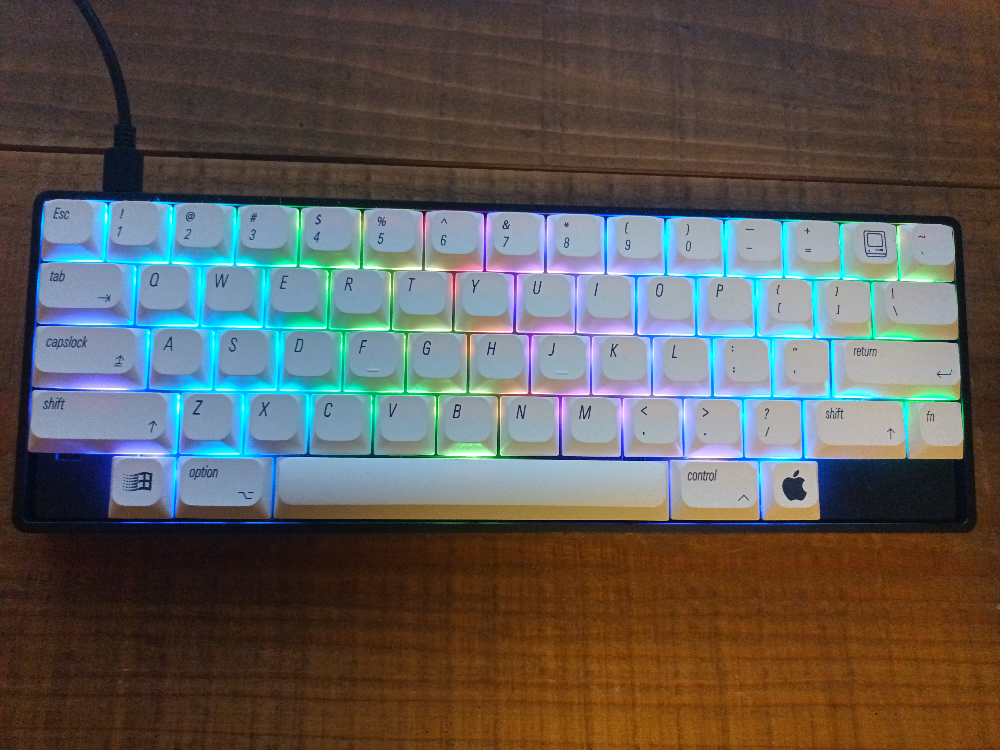

# mfx060b

mfx060bの組み立て方法、及びカスタマイズ方法について記載します。

**組み立て例**

**キーレイアウト**

**目次**

- [組み立てに必要なもの](#組み立てに必要なもの)
- [PCB組み立て](#pcb組み立て)
  - [半田付けについて](#半田付けについて)
- [キーボード組み立て](#キーボード組み立て)
  - [静音化について](#静音化について)
- [キーのカスタマイズ](#キーのカスタマイズ)
  - [Firmwareのビルド](#firmwareのビルド)
- [設計情報](#設計情報)

## 組み立てに必要なもの

1. Picossci RP2040 ピッチ変換基板
2. Choc V2スタビライザー(スクリュータイプ) x3 (2Ux2, 6.25Ux1)
3. Kailh Chocロープロファイル用Switch Socket x60
4. Kailh Choc V2キースイッチ x60
5. キーキャップ x60
6. Poker/GH60互換ケース

## PCB組み立て

1. Picossci RP2040ピッチ変換基板を半田付け  

2. RP2040のBOOTボタンを押しながらPCとPCBを接続する
3. [mfx060b_vial.uf2](./firmware/)をRPI-RP2フォルダにドラッグ＆ドロップする
4. 以下の画像のようにLEDが点灯すれば一旦OK  

5. Kailh Chocロープロファイル用Switch Socketを半田付け
6. キーの動作確認をする（デフォルトではUS配列）

なお、デフォルトではFn+QでBoot loaderを起動することができますので、  
組み立て後に独自のFirmwareに更新する場合に使用してください。

### 半田付けについて

- Picossci RP2040ピッチ変換基板はフラックス使用を推奨
- Switch Socketは向きがあるので注意すること（シルク印字に合わせて実装）

## キーボード組み立て

1. Choc V2スタビライザーを取り付ける
2. Poker互換ケースにPCBをねじ止め
3. キートップフレームにキースイッチを嵌め込む
4. PCBにキートップフレームを差し込む
5. キーキャップを取り付ける

### 静音化について

- PCBのテープmod
  - PCB部品実装面にマスキングテープを貼ると基板とケースの反響を抑えられる
- スタビライザーのバンドエイドmod、ルブ
  - 6.25Uのスタビライザーは特に音が大きい。ステムの底にバンドエイドを貼ると消音効果がある
  - ルブ(潤滑剤)はミニ四駆用のグリスなどでもOK

## キーのカスタマイズ

Vial対応しているためGUIでキーマップを変更することができます。

1. https://get.vial.today/ にアクセス
2. Start Vial Web -> Start Vial -> mfx060b を選択して "接続" をクリック

### Firmwareのビルド

1. vial-qmkをクローンする
2. sourceフォルダ名をmfx060bにリネームする
3. vial-qmkのkeyboardsフォルダにmfx060bフォルダをコピーする
4. make mfx060b:vialを実行する

## 設計情報

- [QMK Vialソースコード](./source/)
- [ハードウェア情報](./hardware/)
